# Diagram architektury autentykacji - MIMO

Ten diagram przedstawia pełny przepływ autentykacji w aplikacji MIMO,
wykorzystującej Astro 5, React 19 i Supabase Auth.

## Architektura przepływu autentykacji

```mermaid
sequenceDiagram
    autonumber
    participant Przeglądarka
    participant Middleware
    participant StronaAstro as Strona Astro
    participant KomponentReact as Komponent React
    participant APIEndpoint as Astro API
    participant SupabaseAuth as Supabase Auth
    participant BazaDanych as Baza Danych

    Note over Przeglądarka,BazaDanych: PRZEPŁYW REJESTRACJI NOWEGO UŻYTKOWNIKA

    Przeglądarka->>Middleware: GET /register
    activate Middleware
    Middleware->>Middleware: Odczyt ciasteczek sesji
    Middleware->>SupabaseAuth: auth.getUser()
    SupabaseAuth-->>Middleware: Brak użytkownika
    Middleware->>Middleware: locals.user = null
    Middleware->>StronaAstro: next()
    deactivate Middleware

    activate StronaAstro
    StronaAstro->>StronaAstro: Sprawdź locals.user
    StronaAstro->>Przeglądarka: Renderuj RegisterForm
    deactivate StronaAstro

    Przeglądarka->>KomponentReact: Wyświetl formularz
    activate KomponentReact
    KomponentReact->>Przeglądarka: Formularz rejestracji
    deactivate KomponentReact

    Przeglądarka->>KomponentReact: Submit (email, hasło)
    activate KomponentReact
    KomponentReact->>KomponentReact: Walidacja Zod
    KomponentReact->>SupabaseAuth: signUp(email, password)
    deactivate KomponentReact

    activate SupabaseAuth
    SupabaseAuth->>BazaDanych: INSERT INTO auth.users
    activate BazaDanych
    BazaDanych-->>SupabaseAuth: OK (user_id)
    deactivate BazaDanych
    SupabaseAuth->>SupabaseAuth: Generuj token weryfikacyjny
    SupabaseAuth->>Przeglądarka: Wyślij email weryfikacyjny
    SupabaseAuth-->>KomponentReact: Sukces (user unconfirmed)
    deactivate SupabaseAuth

    activate KomponentReact
    KomponentReact->>Przeglądarka: Komunikat: Sprawdź email
    deactivate KomponentReact

    Note over Przeglądarka: Użytkownik klika link w emailu

    Przeglądarka->>Middleware: GET /login?token=xyz&type=signup
    activate Middleware
    Middleware->>Middleware: Odczyt ciasteczek
    Middleware->>SupabaseAuth: auth.getUser()
    SupabaseAuth-->>Middleware: Brak użytkownika
    Middleware->>StronaAstro: next()
    deactivate Middleware

    activate StronaAstro
    StronaAstro->>Przeglądarka: Renderuj LoginForm
    deactivate StronaAstro

    activate KomponentReact
    KomponentReact->>SupabaseAuth: onAuthStateChange (nasłuch)
    SupabaseAuth->>SupabaseAuth: Weryfikacja tokenu z URL
    SupabaseAuth->>BazaDanych: UPDATE auth.users SET confirmed
    activate BazaDanych
    BazaDanych-->>SupabaseAuth: OK
    deactivate BazaDanych
    SupabaseAuth->>SupabaseAuth: Generuj access_token, refresh_token
    SupabaseAuth-->>KomponentReact: SIGNED_IN event + session
    KomponentReact->>Przeglądarka: Przekieruj do /
    deactivate KomponentReact

    Note over Przeglądarka,BazaDanych: PRZEPŁYW LOGOWANIA ISTNIEJĄCEGO UŻYTKOWNIKA

    Przeglądarka->>Middleware: GET /login
    activate Middleware
    Middleware->>Middleware: Odczyt ciasteczek
    Middleware->>SupabaseAuth: auth.getUser()
    SupabaseAuth-->>Middleware: Brak użytkownika
    Middleware->>StronaAstro: next()
    deactivate Middleware

    activate StronaAstro
    StronaAstro->>Przeglądarka: Renderuj LoginForm
    deactivate StronaAstro

    Przeglądarka->>KomponentReact: Wprowadź dane
    activate KomponentReact
    KomponentReact->>Przeglądarka: Formularz logowania
    deactivate KomponentReact

    Przeglądarka->>KomponentReact: Submit (email, hasło)
    activate KomponentReact
    KomponentReact->>KomponentReact: Walidacja
    KomponentReact->>SupabaseAuth: signInWithPassword(email, pwd)
    deactivate KomponentReact

    activate SupabaseAuth
    SupabaseAuth->>BazaDanych: SELECT * FROM auth.users
    activate BazaDanych
    BazaDanych-->>SupabaseAuth: Dane użytkownika + hash hasła
    deactivate BazaDanych
    SupabaseAuth->>SupabaseAuth: Weryfikuj hasło (bcrypt)
    SupabaseAuth->>SupabaseAuth: Generuj JWT access_token (1h)
    SupabaseAuth->>SupabaseAuth: Generuj refresh_token (7 dni)
    SupabaseAuth-->>KomponentReact: session object z tokenami
    deactivate SupabaseAuth

    activate KomponentReact
    KomponentReact->>KomponentReact: Zapisz tokeny (localStorage)
    KomponentReact->>Przeglądarka: window.location.href = /
    deactivate KomponentReact

    Note over Przeglądarka,BazaDanych: WERYFIKACJA SESJI I SYNCHRONIZACJA CIASTECZEK

    Przeglądarka->>Middleware: GET / (z tokenami w localStorage)
    activate Middleware
    Middleware->>Middleware: Odczyt ciasteczek sesji

    alt Ciasteczka istnieją
        Middleware->>SupabaseAuth: setSession(access, refresh)
        activate SupabaseAuth
        SupabaseAuth-->>Middleware: OK
        deactivate SupabaseAuth
    else Brak ciasteczek (pierwsze logowanie)
        Note over Middleware: Supabase client ma tokeny w localStorage
    end

    Middleware->>SupabaseAuth: auth.getUser()
    activate SupabaseAuth
    SupabaseAuth->>SupabaseAuth: Weryfikuj JWT access_token

    alt Token ważny
        SupabaseAuth-->>Middleware: user data
        Middleware->>Middleware: locals.user = user
        Middleware->>SupabaseAuth: auth.getSession()
        SupabaseAuth-->>Middleware: session z tokenami
        Middleware->>Middleware: Ustaw ciasteczko sb-access-token
        Middleware->>Middleware: Ustaw ciasteczko sb-refresh-token
    else Token wygasły lub nieważny
        SupabaseAuth-->>Middleware: error
        Middleware->>Middleware: locals.user = null
        Middleware->>Middleware: Usuń ciasteczka sesji
    end
    deactivate SupabaseAuth

    Middleware->>StronaAstro: next()
    deactivate Middleware

    activate StronaAstro
    StronaAstro->>StronaAstro: Sprawdź locals.user

    alt Użytkownik zalogowany
        StronaAstro->>BazaDanych: SELECT aktywne zadanie
        activate BazaDanych
        BazaDanych-->>StronaAstro: Zadanie (lub brak)
        deactivate BazaDanych

        alt Ma aktywne zadanie
            StronaAstro->>Przeglądarka: Przekieruj do /task
        else Brak aktywnego zadania
            StronaAstro->>Przeglądarka: Przekieruj do /checkin
        end
    else Użytkownik niezalogowany
        StronaAstro->>Przeglądarka: Przekieruj do /login
    end
    deactivate StronaAstro

    Note over Przeglądarka,BazaDanych: OCHRONA ENDPOINT API I RLS

    Przeglądarka->>Middleware: POST /api/checkins (z ciasteczkami)
    activate Middleware
    Middleware->>Middleware: Odczyt ciasteczek
    Middleware->>SupabaseAuth: setSession(tokeny z ciasteczek)
    activate SupabaseAuth
    SupabaseAuth-->>Middleware: OK
    deactivate SupabaseAuth
    Middleware->>SupabaseAuth: auth.getUser()
    activate SupabaseAuth
    SupabaseAuth->>SupabaseAuth: Weryfikuj JWT
    SupabaseAuth-->>Middleware: user data
    deactivate SupabaseAuth
    Middleware->>Middleware: locals.user = user
    Middleware->>APIEndpoint: next()
    deactivate Middleware

    activate APIEndpoint
    APIEndpoint->>APIEndpoint: Sprawdź locals.user

    alt Użytkownik zalogowany
        APIEndpoint->>BazaDanych: INSERT INTO check_ins
        activate BazaDanych
        Note over BazaDanych: RLS: WHERE user_id = auth.uid()
        BazaDanych->>BazaDanych: Weryfikuj RLS policy
        BazaDanych-->>APIEndpoint: Dane zapisane
        deactivate BazaDanych
        APIEndpoint-->>Przeglądarka: 201 Created
    else Użytkownik niezalogowany
        APIEndpoint-->>Przeglądarka: 401 Unauthorized
    end
    deactivate APIEndpoint

    Note over Przeglądarka,BazaDanych: ODŚWIEŻANIE WYGASŁEGO ACCESS TOKEN

    Przeglądarka->>Middleware: GET /task (access_token wygasły)
    activate Middleware
    Middleware->>Middleware: Odczyt ciasteczek
    Middleware->>SupabaseAuth: setSession(access, refresh)
    activate SupabaseAuth
    SupabaseAuth-->>Middleware: OK
    deactivate SupabaseAuth
    Middleware->>SupabaseAuth: auth.getUser()
    activate SupabaseAuth
    SupabaseAuth->>SupabaseAuth: Weryfikuj access_token
    SupabaseAuth->>SupabaseAuth: Token wygasły!
    SupabaseAuth->>SupabaseAuth: Użyj refresh_token
    SupabaseAuth->>BazaDanych: Weryfikuj refresh_token
    activate BazaDanych
    BazaDanych-->>SupabaseAuth: Token ważny
    deactivate BazaDanych
    SupabaseAuth->>SupabaseAuth: Generuj nowy access_token
    SupabaseAuth-->>Middleware: user data + nowa sesja
    deactivate SupabaseAuth
    Middleware->>Middleware: locals.user = user
    Middleware->>Middleware: Aktualizuj ciasteczko access_token
    Middleware->>Middleware: Aktualizuj ciasteczko refresh_token
    Middleware->>StronaAstro: next()
    deactivate Middleware

    activate StronaAstro
    StronaAstro->>Przeglądarka: Renderuj stronę zadania
    deactivate StronaAstro

    Note over Przeglądarka,BazaDanych: WYLOGOWANIE UŻYTKOWNIKA

    Przeglądarka->>KomponentReact: Kliknięcie przycisku Wyloguj
    activate KomponentReact
    KomponentReact->>SupabaseAuth: signOut()
    deactivate KomponentReact

    activate SupabaseAuth
    SupabaseAuth->>SupabaseAuth: Inwaliduj sesję
    SupabaseAuth->>BazaDanych: Usuń refresh_token
    activate BazaDanych
    BazaDanych-->>SupabaseAuth: OK
    deactivate BazaDanych
    SupabaseAuth-->>KomponentReact: Sukces
    deactivate SupabaseAuth

    activate KomponentReact
    KomponentReact->>Przeglądarka: window.location.href = /login
    deactivate KomponentReact

    Przeglądarka->>Middleware: GET /login
    activate Middleware
    Middleware->>Middleware: Odczyt ciasteczek (tokeny jeszcze są)
    Middleware->>SupabaseAuth: setSession(tokeny)
    activate SupabaseAuth
    SupabaseAuth-->>Middleware: OK
    deactivate SupabaseAuth
    Middleware->>SupabaseAuth: auth.getUser()
    activate SupabaseAuth
    SupabaseAuth-->>Middleware: Sesja nieważna (wylogowany)
    deactivate SupabaseAuth
    Middleware->>Middleware: locals.user = null
    Middleware->>Middleware: Usuń ciasteczko sb-access-token
    Middleware->>Middleware: Usuń ciasteczko sb-refresh-token
    Middleware->>StronaAstro: next()
    deactivate Middleware

    activate StronaAstro
    StronaAstro->>Przeglądarka: Renderuj LoginForm
    deactivate StronaAstro

    Note over Przeglądarka,BazaDanych: RESETOWANIE HASŁA

    Przeglądarka->>KomponentReact: /forgot-password
    activate KomponentReact
    KomponentReact->>Przeglądarka: Formularz z polem email
    deactivate KomponentReact

    Przeglądarka->>KomponentReact: Submit email
    activate KomponentReact
    KomponentReact->>SupabaseAuth: resetPasswordForEmail(email)
    deactivate KomponentReact

    activate SupabaseAuth
    SupabaseAuth->>BazaDanych: SELECT user BY email
    activate BazaDanych
    BazaDanych-->>SupabaseAuth: User data
    deactivate BazaDanych
    SupabaseAuth->>SupabaseAuth: Generuj recovery token
    SupabaseAuth->>Przeglądarka: Wyślij email z linkiem
    SupabaseAuth-->>KomponentReact: Sukces
    deactivate SupabaseAuth

    activate KomponentReact
    KomponentReact->>Przeglądarka: Komunikat: Sprawdź email
    deactivate KomponentReact

    Note over Przeglądarka: Użytkownik klika link w emailu

    Przeglądarka->>Middleware: GET /reset-password?code=token
    activate Middleware
    Middleware->>StronaAstro: next()
    deactivate Middleware

    activate StronaAstro
    StronaAstro->>StronaAstro: Waliduj token z URL
    StronaAstro->>Przeglądarka: Renderuj ResetPasswordForm
    deactivate StronaAstro

    Przeglądarka->>KomponentReact: Wprowadź nowe hasło
    activate KomponentReact
    KomponentReact->>SupabaseAuth: verifyOtp(token, type recovery)
    activate SupabaseAuth
    SupabaseAuth->>BazaDanych: Weryfikuj token
    activate BazaDanych
    BazaDanych-->>SupabaseAuth: Token ważny
    deactivate BazaDanych
    SupabaseAuth-->>KomponentReact: session
    deactivate SupabaseAuth
    KomponentReact->>SupabaseAuth: updateUser(new password)
    activate SupabaseAuth
    SupabaseAuth->>BazaDanych: UPDATE auth.users SET password
    activate BazaDanych
    BazaDanych-->>SupabaseAuth: OK
    deactivate BazaDanych
    SupabaseAuth-->>KomponentReact: Sukces
    deactivate SupabaseAuth
    KomponentReact->>Przeglądarka: Przekieruj do /login
    deactivate KomponentReact

    Note over Przeglądarka,BazaDanych: WYGAŚNIĘCIE REFRESH TOKEN (7 DNI)

    Przeglądarka->>Middleware: GET / (po 7 dniach)
    activate Middleware
    Middleware->>Middleware: Odczyt ciasteczek
    Middleware->>SupabaseAuth: setSession(stare tokeny)
    activate SupabaseAuth
    SupabaseAuth-->>Middleware: OK
    deactivate SupabaseAuth
    Middleware->>SupabaseAuth: auth.getUser()
    activate SupabaseAuth
    SupabaseAuth->>SupabaseAuth: access_token wygasły
    SupabaseAuth->>SupabaseAuth: Sprawdź refresh_token
    SupabaseAuth->>BazaDanych: Weryfikuj refresh_token
    activate BazaDanych
    BazaDanych-->>SupabaseAuth: Token wygasły (7 dni)
    deactivate BazaDanych
    SupabaseAuth-->>Middleware: Błąd: Sesja wygasła
    deactivate SupabaseAuth
    Middleware->>Middleware: locals.user = null
    Middleware->>Middleware: Usuń wszystkie ciasteczka
    Middleware->>StronaAstro: next()
    deactivate Middleware

    activate StronaAstro
    StronaAstro->>StronaAstro: Sprawdź locals.user (null)
    StronaAstro->>Przeglądarka: Przekieruj do /login
    deactivate StronaAstro

    Przeglądarka->>Przeglądarka: Komunikat: Sesja wygasła, zaloguj się
```



## Kluczowe elementy architektury

### 1. Middleware Astro (src/middleware/index.ts)
- **Rola**: Strażnik autentykacji dla każdego żądania HTTP
- **Odpowiedzialności**:
  - Odczyt tokenów z ciasteczek HTTP-only
  - Synchronizacja sesji z Supabase client
  - Weryfikacja użytkownika przez `auth.getUser()`
  - Automatyczna aktualizacja ciasteczek przy odświeżeniu tokenów
  - Usuwanie ciasteczek gdy sesja nieważna
  - Ustawienie `context.locals.user` i `context.locals.supabase`

### 2. Tokeny i sesje
- **Access Token (JWT)**: Ważny 1 godzinę, używany do weryfikacji tożsamości
- **Refresh Token**: Ważny 7 dni, używany do odnawiania access token
- **Przechowywanie**: Ciasteczka HTTP-only (bezpieczne, niedostępne z JS)
- **Autorefresh**: Supabase client automatycznie odnawia tokeny

### 3. Row Level Security (RLS)
- **Polityki**: `WHERE user_id = auth.uid()`
- **Automatyczna**: JWT zawiera `user_id`, używany w RLS
- **Izolacja danych**: Każdy użytkownik widzi tylko swoje dane
- **Egzekwowana na poziomie bazy**: Nie można ominąć

### 4. Ochrona tras
**Strony Astro (SSR)**:
```typescript
const user = Astro.locals.user;
if (!user) return Astro.redirect("/login");
```

**API Endpoints**:
```typescript
const { data: { user } } = await locals.supabase.auth.getUser();
if (!user) return new Response("Unauthorized", { status: 401 });
```

### 5. Przepływ danych po zalogowaniu
1. Użytkownik zalogowany → tokeny w ciasteczkach
2. Każde żądanie → middleware weryfikuje i odświeża tokeny
3. `Astro.locals.user` dostępne w stronach i API
4. Komponenty React przekierowują do `/login` przy 401

### 6. Bezpieczeństwo
- **HTTPS**: Wymuszony dla produkcji
- **HTTP-only cookies**: Tokeny niedostępne z JavaScript (XSS protection)
- **Secure flag**: Ciasteczka tylko przez HTTPS
- **SameSite: lax**: Ochrona przed CSRF
- **JWT**: Cyfrowo podpisane, niemożliwe do podrobienia
- **RLS**: Izolacja danych na poziomie bazy

### 7. Obsługa błędów
- **401 Unauthorized**: Przekierowanie do `/login`
- **Token wygasły**: Automatyczne odświeżenie lub logout
- **Błędy sieci**: Komunikaty user-friendly po polsku
- **Walidacja**: Client-side (UX) + Server-side (security)

