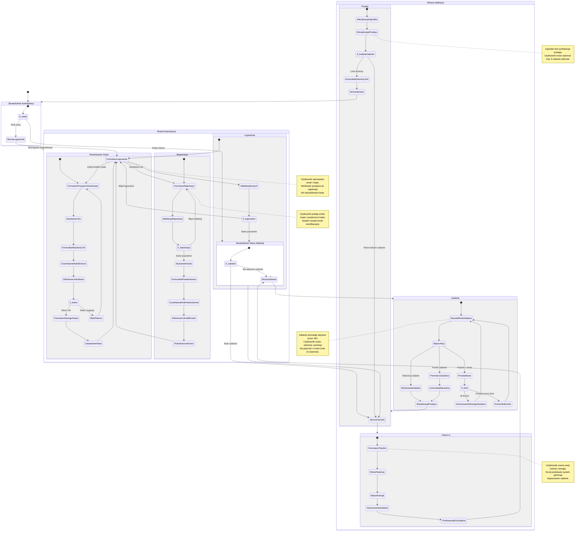

# Diagram podróży użytkownika - MIMO

## Przegląd

Diagram przedstawia podróż użytkownika w aplikacji MIMO, od pierwszego kontaktu z aplikacją, przez proces autentykacji, aż po codzienne korzystanie z funkcji check-in i wykonywania zadań.

## Diagram

## Opis przepływów

### 1. Nowy użytkownik (Pierwsza wizyta)

**Cel:** Utworzenie konta i pierwsze użycie aplikacji

**Kroki:**

1. Użytkownik wchodzi na stronę główną
2. System sprawdza autentykację → brak sesji
3. Przekierowanie do strony logowania
4. Użytkownik klika "Zarejestruj się"
5. Wypełnia formularz rejestracji (email, hasło, powtórz hasło)
6. System wysyła email weryfikacyjny
7. Komunikat o konieczności potwierdzenia emaila
8. Użytkownik klika link w emailu
9. Konto zostaje potwierdzone
10. Przekierowanie do formularza logowania
11. Użytkownik loguje się
12. System sprawdza stan → brak zadania
13. Przekierowanie do check-in
14. Użytkownik wybiera nastrój i energię
15. System generuje zadanie
16. Wyświetlenie zadania
17. Użytkownik wykonuje lub pomija zadanie
18. Aktualizacja postępu w ogródku
19. Wizualizacja osiągnięć

**Punkty decyzyjne:**

- Walidacja danych rejestracji (email unikalny, hasło silne)
- Potwierdzenie emaila (konto nieaktywne do czasu potwierdzenia)
- Walidacja danych logowania

### 2. Powracający użytkownik z ważną sesją

**Cel:** Kontynuacja korzystania z aplikacji

**Kroki:**

1. Użytkownik wchodzi na stronę główną
2. System sprawdza autentykację → sesja ważna
3. System sprawdza stan zadania
4. **Scenariusz A - Ma aktywne zadanie:**
   - Przekierowanie do strony zadania
   - Wyświetlenie zadania
   - Wybór akcji: wykonanie/pominięcie/nowe zadanie
   - Aktualizacja postępu
   - Wizualizacja
5. **Scenariusz B - Brak zadania:**
   - Przekierowanie do check-in
   - Wybór nastroju i energii
   - Generowanie zadania
   - Wyświetlenie zadania
   - Dalsza ścieżka jak w Scenariuszu A

**Punkty decyzyjne:**

- Czy użytkownik ma aktywne zadanie z dzisiaj?
- Czy użytkownik osiągnął dzienny limit zadań? (max 3)
- Czy użytkownik przekroczył limit próśb o nowe zadanie? (max 3)

### 3. Powracający użytkownik z wygasłą sesją

**Cel:** Ponowne uwierzytelnienie

**Kroki:**

1. Użytkownik wchodzi na stronę główną
2. System sprawdza autentykację → sesja wygasła
3. Przekierowanie do strony logowania
4. Użytkownik wprowadza email i hasło
5. System weryfikuje dane
6. Po sukcesie: przekierowanie do głównej aplikacji
7. Dalsza ścieżka jak w scenariuszu "Powracający użytkownik z ważną sesją"

### 4. Resetowanie hasła

**Cel:** Odzyskanie dostępu do konta

**Kroki:**

1. Użytkownik klika "Zapomniałeś hasła?" na stronie logowania
2. Przekierowanie do formularza przypomnienia hasła
3. Użytkownik wprowadza adres email
4. System wysyła link resetujący na email
5. Komunikat o wysłaniu linku
6. Użytkownik klika link w emailu
7. System weryfikuje token
8. **Jeśli token OK:**
   - Wyświetlenie formularza nowego hasła
   - Użytkownik wprowadza nowe hasło
   - System ustawia nowe hasło
   - Przekierowanie do logowania
9. **Jeśli token wygasły:**
   - Komunikat o błędzie
   - Powrót do formularza przypomnienia hasła

**Punkty decyzyjne:**

- Czy token resetowania jest ważny?
- Czy nowe hasło spełnia wymagania bezpieczeństwa?

### 5. Wykonywanie zadania (szczegółowy przepływ)

**Cel:** Realizacja przydzielonego zadania

**Kroki:**

1. Użytkownik widzi przydzielone zadanie
2. Ma do wyboru 3 akcje:

   **Akcja A - Wykonaj zadanie:**
   - Użytkownik klika "Wykonaj zadanie"
   - System aktualizuje postęp
   - System sadzi nowe drzewo w ogródku
   - Wyświetlenie wizualizacji postępu
   - Empatyczny komunikat gratulacyjny
   - Sprawdzenie czy użytkownik może wykonać kolejne zadanie (max 3/dzień)

   **Akcja B - Pomiń zadanie:**
   - Użytkownik klika "Pomiń zadanie"
   - System zapisuje pominięcie
   - Wyświetlenie neutralnego, wspierającego komunikatu
   - Aktualizacja stanu (zadanie możliwe ponownie)
   - Użytkownik może wykonać nowy check-in

   **Akcja C - Poproś o nowe zadanie:**
   - Użytkownik klika "Poproś o nowe zadanie"
   - System sprawdza limit (max 3 razy dziennie)
   - **Jeśli w limicie:**
     - Generowanie nowego zadania
     - Wyświetlenie nowego zadania
   - **Jeśli przekroczono limit:**
     - Wyświetlenie neutralnego komunikatu
     - Brak możliwości generowania nowego

**Punkty decyzyjne:**

- Którą akcję wybiera użytkownik?
- Czy użytkownik przekroczył limit próśb o nowe zadanie?
- Czy użytkownik osiągnął dzienny limit wykonanych zadań?

### 6. Wylogowanie

**Cel:** Zakończenie sesji użytkownika

**Kroki:**

1. Użytkownik klika przycisk "Wyloguj się" w prawym górnym rogu
2. System wywołuje `signOut()` w Supabase
3. Usunięcie sesji i tokenów
4. Przekierowanie do strony logowania
5. Komunikat potwierdzający wylogowanie

## Kluczowe zasady biznesowe

### Zasady autentykacji

1. **Wymagane logowanie:** Użytkownik NIE MOŻE korzystać z funkcji aplikacji bez zalogowania
2. **Tylko email/hasło:** Brak opcji logowania przez Google, GitHub czy innych dostawców OAuth
3. **Weryfikacja emaila:** Użytkownik musi potwierdzić email przed pierwszym logowaniem
4. **Bezpieczeństwo:** Hasło musi mieć minimum 8 znaków

### Zasady check-in i zadań

1. **Jedno zadanie dziennie:** Zadanie pozostaje aktywne przez 24 godziny
2. **Nowy check-in możliwy gdy:**
   - Zadanie zostało wykonane
   - Zadanie zostało pominięte
   - Upłynęło 24h od przydzielenia zadania
3. **Limit nowych zadań:** Maksymalnie 3 próby wygenerowania nowego zadania dziennie
4. **Limit wykonanych zadań:** Maksymalnie 3 zadania dziennie

### Zasady postępu

1. **Ogródek 5x6:** Plansza składa się z 30 pól
2. **Sadzenie drzew:** Za każde wykonane zadanie użytkownik sadzi jedno drzewo
3. **Historia zadań:** System zapobiega ponownemu przydzieleniu ostatnio wykonanych/pominiętych zadań

## Stany emocjonalne użytkownika

Diagram uwzględnia różne stany emocjonalne użytkownika w zależności od punktu podróży:

- **Nowy użytkownik:** Niepewność, ciekawość → komunikaty powinny być jasne i zachęcające
- **Po rejestracji:** Oczekiwanie → komunikat o konieczności potwierdzenia emaila
- **Po zalogowaniu:** Gotowość do działania → szybkie przekierowanie do check-in
- **Przy check-in:** Refleksja nad sobą → empatyczne pytania o nastrój i energię
- **Przy zadaniu:** Motywacja/przytłoczenie → zadanie dopasowane do stanu
- **Po wykonaniu:** Satysfakcja → gratulacyjny komunikat
- **Po pominięciu:** Akceptacja → neutralny, wspierający komunikat
- **Przy postępie:** Poczucie osiągnięcia → wizualizacja ogródka

## Komunikaty systemowe

### Komunikaty sukcesu

- **Po rejestracji:** "Konto zostało utworzone! Wysłaliśmy link aktywacyjny na adres {email}. Kliknij w link, aby aktywować konto."
- **Po wykonaniu zadania:** "Wspaniale! Wykonałeś zadanie. Twój ogródek rośnie!" (z ikoną emocji dopasowaną do nastroju)
- **Po aktualizacji postępu:** Wizualizacja ogródka z nowo zasadzonym drzewem

### Komunikaty neutralne

- **Po pominięciu:** "W porządku. Możesz wrócić do zadania później lub wykonać nowy check-in."
- **Limit nowych zadań:** "Osiągnąłeś dzienny limit próśb o nowe zadanie. Spróbuj wykonać obecne zadanie lub wróć jutro."
- **Limit wykonanych zadań:** "Świetna robota! Wykonałeś dzisiaj 3 zadania. Wróć jutro po nowe wyzwania."

### Komunikaty błędów

- **Błąd logowania:** "Nieprawidłowy email lub hasło. Spróbuj ponownie."
- **Email już istnieje:** "Konto z tym adresem email już istnieje. Czy chcesz się zalogować?"
- **Słabe hasło:** "Hasło jest zbyt słabe. Użyj minimum 8 znaków, w tym liter i cyfr."
- **Token wygasły:** "Link do resetowania hasła wygasł. Poproś o nowy link."

## Metryki do śledzenia

Dla optymalizacji doświadczenia użytkownika, zaleca się śledzenie:

1. **Metryki autentykacji:**
   - Wskaźnik rejestracji (conversion rate)
   - Czas do potwierdzenia emaila
   - Wskaźnik porzucenia procesu rejestracji
   - Liczba nieudanych prób logowania

2. **Metryki głównej aplikacji:**
   - Liczba wykonanych check-inów dziennie
   - Wskaźnik wykonania zadań vs pominięcia
   - Liczba próśb o nowe zadanie
   - Retencja 7-dniowa i 30-dniowa

3. **Metryki postępu:**
   - Średnia liczba zadań wykonanych przez użytkownika
   - Wzrost liczby drzew w ogródku
   - Długość serii (streak) wykonywania zadań
