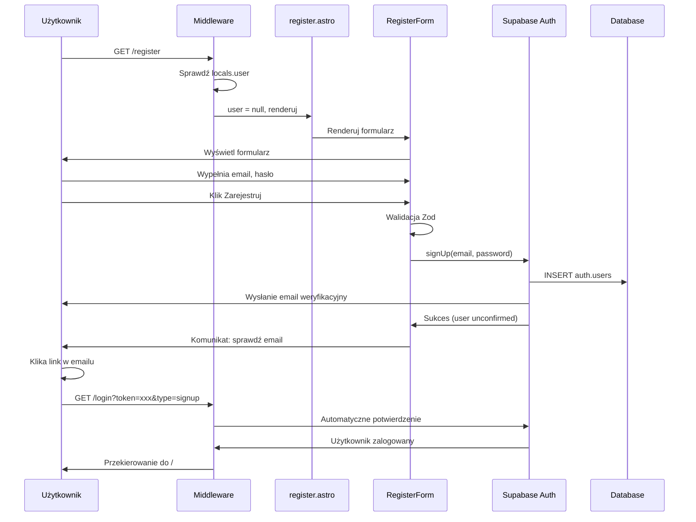
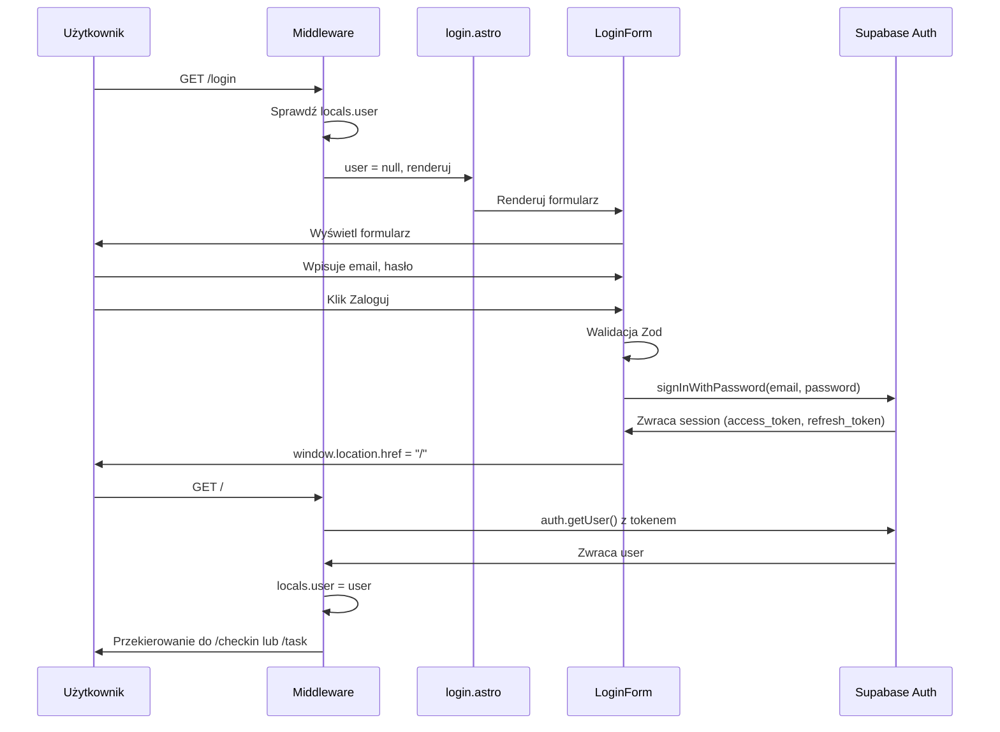
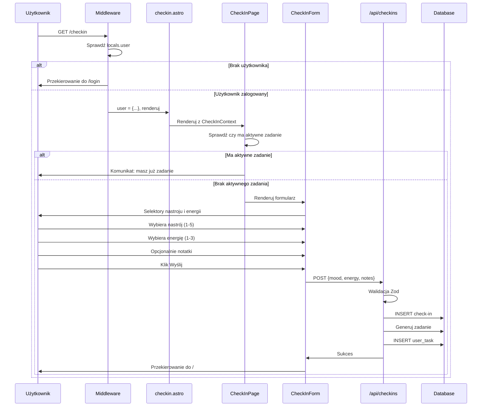
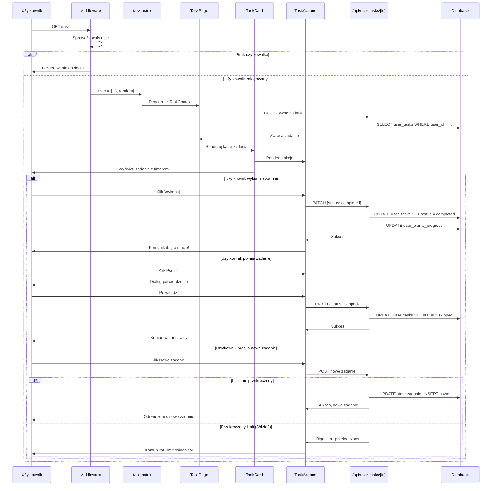
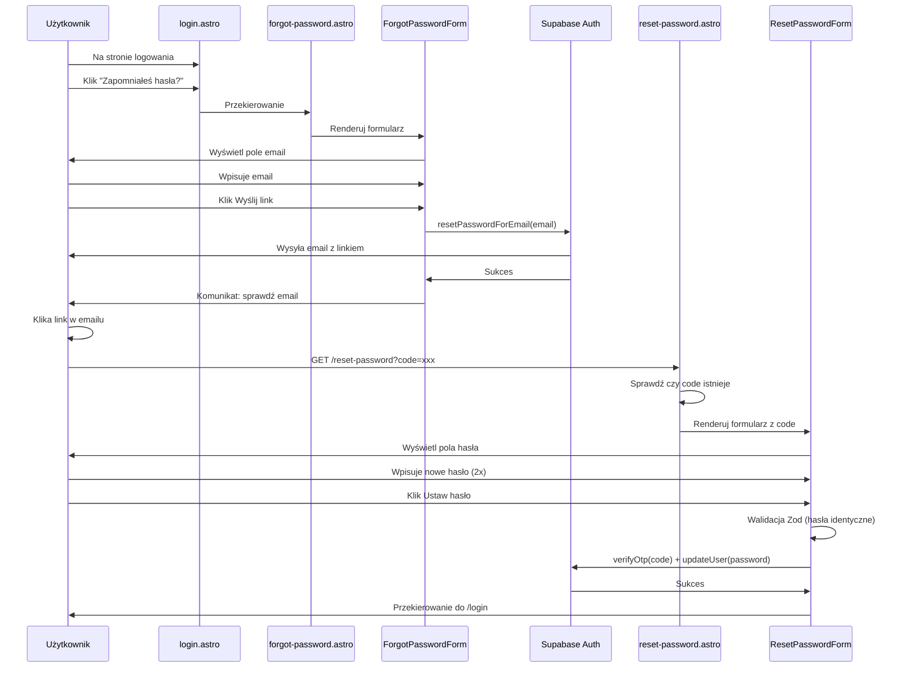

# Diagram architektury UI - MIMO

Ten diagram przedstawia pełną architekturę interfejsu użytkownika aplikacji MIMO,
obejmującą moduł autentykacji oraz istniejące funkcjonalności (check-in, zadania).

## Struktura UI - Przepływ komponentów

```mermaid
flowchart TD
    subgraph "Middleware i Routing"
        MW[Middleware Astro] --> |sprawdza sesję| LOCAL[locals.user + locals.supabase]
        LOCAL --> |dostępne dla stron| PAGES[Strony Astro]
    end

    subgraph "Strefa Publiczna - Autentykacja"
        direction TB
        LOGIN_PAGE[Strona login.astro] --> |renderuje| LOGIN_FORM[LoginForm React]
        REGISTER_PAGE[Strona register.astro] --> |renderuje| REGISTER_FORM[RegisterForm React]
        FORGOT_PAGE[Strona forgot-password.astro] --> |renderuje| FORGOT_FORM[ForgotPasswordForm React]
        RESET_PAGE[Strona reset-password.astro] --> |renderuje| RESET_FORM[ResetPasswordForm React]

        LOGIN_FORM --> |walidacja Zod| LOGIN_FORM
        LOGIN_FORM --> |signInWithPassword| SUPABASE_AUTH[Supabase Auth API]

        REGISTER_FORM --> |walidacja Zod| REGISTER_FORM
        REGISTER_FORM --> |signUp| SUPABASE_AUTH

        FORGOT_FORM --> |resetPasswordForEmail| SUPABASE_AUTH

        RESET_FORM --> |verifyOtp + updateUser| SUPABASE_AUTH

        SUPABASE_AUTH --> |sukces| REDIRECT_HOME[Przekierowanie do głównej]
    end

    subgraph "Strefa Chroniona - Funkcjonalności Główne"
        direction TB
        INDEX_PAGE[Strona index.astro] --> |sprawdza locals.user| AUTH_CHECK{Użytkownik zalogowany?}
        AUTH_CHECK --> |NIE| REDIRECT_LOGIN[Przekierowanie do /login]
        AUTH_CHECK --> |TAK| CHECK_TASK{Czy ma aktywne zadanie?}
        CHECK_TASK --> |TAK| REDIRECT_TASK[Przekierowanie do /task]
        CHECK_TASK --> |NIE| REDIRECT_CHECKIN[Przekierowanie do /checkin]

        CHECKIN_PAGE[Strona checkin.astro] --> |sprawdza locals.user| CHECKIN_AUTH{Zalogowany?}
        CHECKIN_AUTH --> |NIE| REDIRECT_LOGIN
        CHECKIN_AUTH --> |TAK| CHECKIN_COMPONENT[CheckInPage React]

        TASK_PAGE[Strona task.astro] --> |sprawdza locals.user| TASK_AUTH{Zalogowany?}
        TASK_AUTH --> |NIE| REDIRECT_LOGIN
        TASK_AUTH --> |TAK| TASK_COMPONENT[TaskPage React]
    end

    subgraph "Komponenty Check-In"
        direction LR
        CHECKIN_COMPONENT --> |używa| CHECKIN_CONTEXT[CheckInContext]
        CHECKIN_COMPONENT --> |renderuje| CHECKIN_FORM_COMP[CheckInForm]
        CHECKIN_FORM_COMP --> |zawiera| MOOD_SELECTOR[MoodSelector]
        CHECKIN_FORM_COMP --> |zawiera| ENERGY_SELECTOR[EnergySelector]
        CHECKIN_FORM_COMP --> |submit| API_CHECKINS[POST /api/checkins]
        API_CHECKINS --> |sukces| CHECKIN_SUCCESS[Przekierowanie do głównej]
    end

    subgraph "Komponenty Zadań"
        direction LR
        TASK_COMPONENT --> |używa| TASK_CONTEXT[TaskContext]
        TASK_COMPONENT --> |renderuje| TASK_CARD[TaskCard]
        TASK_CARD --> |zawiera| TASK_ACTIONS[TaskActions]
        TASK_CARD --> |zawiera| EXPIRATION_TIMER[ExpirationTimer]
        TASK_ACTIONS --> |wykonaj/pomiń| API_USER_TASKS[PATCH /api/user-tasks/id]
        TASK_ACTIONS --> |nowe zadanie| API_USER_TASKS
        API_USER_TASKS --> |aktualizacja| TASK_CONTEXT
    end

    subgraph "Layout i Komponenty Współdzielone"
        direction TB
        LAYOUT[Layout.astro] --> |opakowuje wszystkie strony| ALL_PAGES[Wszystkie strony]
        LAYOUT --> |wyświetla przyciski auth| AUTH_BUTTONS{locals.user?}
        AUTH_BUTTONS --> |TAK| LOGOUT_BUTTON[Przycisk Wyloguj + email]
        AUTH_BUTTONS --> |NIE| LOGIN_BUTTON[Przycisk Zaloguj]
        LOGOUT_BUTTON --> |POST| API_LOGOUT[/api/auth/logout]
        LOGIN_BUTTON --> |href| LOGIN_PAGE

        UI_COMPONENTS[Komponenty Shadcn/ui] --> |używane przez| ALL_COMPONENTS[Wszystkie komponenty React]
        UI_COMPONENTS --> |Button, Card, Label, etc.| UI_COMPONENTS
    end

    subgraph "Zarządzanie Stanem"
        direction TB
        CHECKIN_CONTEXT --> |fetchuje| API_CHECKINS
        TASK_CONTEXT --> |fetchuje| API_USER_TASKS

        OPTIONAL_AUTH_CONTEXT[AuthContext opcjonalnie] -.-> |zarządza stanem auth| LOGIN_FORM
        OPTIONAL_AUTH_CONTEXT -.-> |zarządza stanem auth| REGISTER_FORM
    end

    subgraph "Backend API Endpoints"
        direction TB
        API_CHECKINS --> |weryfikuje auth| SUPABASE_DB[(Supabase Database)]
        API_USER_TASKS --> |weryfikuje auth| SUPABASE_DB
        API_LOGOUT --> |signOut| SUPABASE_AUTH

        OPTIONAL_API_AUTH[/api/auth/* opcjonalnie] -.-> |wrapper| SUPABASE_AUTH
    end

    %% Główne połączenia
    PAGES --> INDEX_PAGE
    PAGES --> LOGIN_PAGE
    PAGES --> REGISTER_PAGE
    PAGES --> FORGOT_PAGE
    PAGES --> RESET_PAGE
    PAGES --> CHECKIN_PAGE
    PAGES --> TASK_PAGE

    MW --> |dla każdego żądania| SUPABASE_AUTH

    classDef newComponent fill:#a8dadc,stroke:#457b9d,stroke-width:2px
    classDef existingComponent fill:#f1faee,stroke:#457b9d,stroke-width:1px
    classDef modifiedComponent fill:#e9c46a,stroke:#f77f00,stroke-width:2px
    classDef optional fill:#ddd,stroke:#999,stroke-width:1px,stroke-dasharray: 5 5

    class LOGIN_PAGE,REGISTER_PAGE,FORGOT_PAGE,RESET_PAGE,LOGIN_FORM,REGISTER_FORM,FORGOT_FORM,RESET_FORM newComponent
    class CHECKIN_COMPONENT,TASK_COMPONENT,CHECKIN_FORM_COMP,TASK_CARD,MOOD_SELECTOR,ENERGY_SELECTOR,TASK_ACTIONS,EXPIRATION_TIMER existingComponent
    class LAYOUT,INDEX_PAGE,CHECKIN_PAGE,TASK_PAGE,MW modifiedComponent
    class OPTIONAL_AUTH_CONTEXT,OPTIONAL_API_AUTH optional
```

## Legenda

- **🟦 Niebieski (Nowe komponenty)**: Komponenty i strony dodane w ramach modułu autentykacji
- **🟩 Zielony (Istniejące komponenty)**: Komponenty już obecne w aplikacji
- **🟨 Żółty (Zmodyfikowane komponenty)**: Komponenty wymagające aktualizacji
- **⚪ Biały przerywaną linią (Opcjonalne)**: Komponenty opcjonalne do rozważenia

## Kluczowe przepływy użytkownika

### 1. Przepływ rejestracji nowego użytkownika



### 2. Przepływ logowania



### 3. Przepływ check-in i generowania zadania



### 4. Przepływ wykonywania zadania



### 5. Przepływ odzyskiwania hasła



## Opis warstw architektury

### Warstwa prezentacji (Strony Astro)

Strony Astro działają w trybie SSR i są odpowiedzialne za:

- Server-side sprawdzenie autentykacji (`locals.user`)
- Przekierowania w zależności od stanu użytkownika
- Renderowanie komponentów React z dyrektywą `client:load`
- Przekazywanie danych z serwera do komponentów klienckich

**Nowe strony:**

- `login.astro` - strona logowania
- `register.astro` - strona rejestracji
- `forgot-password.astro` - przypomnienie hasła
- `reset-password.astro` - resetowanie hasła

**Zmodyfikowane strony:**

- `index.astro` - dodano sprawdzenie auth i logikę przekierowań
- `checkin.astro` - dodano sprawdzenie auth
- `task.astro` - dodano sprawdzenie auth

### Warstwa komponentów (React)

Komponenty React są używane tylko dla interaktywnych elementów UI:

**Nowe komponenty autentykacji:**

- `LoginForm.tsx` - formularz logowania z walidacją
- `RegisterForm.tsx` - formularz rejestracji
- `ForgotPasswordForm.tsx` - formularz przypomnienia hasła
- `ResetPasswordForm.tsx` - formularz resetowania hasła

**Istniejące komponenty funkcjonalności:**

- `CheckInPage.tsx` - główny kontener strony check-in
- `CheckInForm.tsx` - formularz check-in z walidacją
- `MoodSelector.tsx` - selektor nastroju (1-5)
- `EnergySelector.tsx` - selektor energii (1-3)
- `TaskPage.tsx` - główny kontener strony zadań
- `TaskCard.tsx` - karta pojedynczego zadania
- `TaskActions.tsx` - akcje dla zadania (wykonaj, pomiń, nowe)
- `ExpirationTimer.tsx` - timer wygaśnięcia zadania
- `MessageBanner.tsx` - banner z komunikatami

### Warstwa kontekstów (Zarządzanie stanem)

**Istniejące konteksty:**

- `CheckInContext.tsx` - zarządzanie stanem check-in, fetchowanie aktywnego zadania
- `TaskContext.tsx` - zarządzanie stanem zadań, akcje na zadaniach

**Opcjonalny nowy kontekst:**

- `AuthContext.tsx` - zarządzanie stanem autentykacji po stronie klienta (opcjonalnie, większość autentykacji jest server-side)

### Warstwa layoutu

**Zmodyfikowany layout:**

- `Layout.astro` - **WYMAGANA MODYFIKACJA**: dodanie przycisków logowania/wylogowania w prawym górnym rogu
  - Jeśli `locals.user` istnieje: wyświetl email + przycisk "Wyloguj się"
  - Jeśli brak `locals.user`: wyświetl przycisk "Zaloguj się"

### Warstwa middleware

**Zmodyfikowany middleware:**

- `middleware/index.ts` - rozszerzenie o:
  - Zarządzanie ciasteczkami sesji (HTTP-only)
  - Synchronizację sesji między klientem a serwerem
  - Odświeżanie tokenów
  - Opcjonalnie: logowanie zdarzeń autentykacyjnych

### Warstwa API

**Istniejące endpointy:**

- `POST /api/checkins` - tworzenie check-inu
- `GET /api/checkins/[id]` - pobieranie check-inu
- `GET /api/user-tasks` - lista zadań
- `PATCH /api/user-tasks/[id]` - aktualizacja zadania
- `GET /api/task-templates` - szablony zadań
- `GET /api/plants-progress` - postępy użytkownika

**Opcjonalne nowe endpointy:**

- `POST /api/auth/register` - wrapper dla rejestracji
- `POST /api/auth/login` - wrapper dla logowania
- `POST /api/auth/logout` - wylogowanie

### Warstwa UI komponentów (Shadcn/ui)

Współdzielone komponenty UI używane przez wszystkie komponenty React:

- `Button` - przyciski
- `Card` - karty
- `Label` - etykiety
- `Alert Dialog` - dialogi
- `Avatar` - awatary

## Kluczowe zależności i przepływy danych

### 1. Przepływ autentykacji

```
Użytkownik → LoginForm → Supabase Auth → Session (tokens) →
→ Middleware → locals.user → Strony Astro → Sprawdzenie auth →
→ Renderowanie komponentów lub przekierowanie
```

### 2. Przepływ check-in

```
Użytkownik → CheckInForm → Walidacja Zod → POST /api/checkins →
→ Weryfikacja auth (middleware) → INSERT check-in → Generowanie zadania →
→ INSERT user_task → Sukces → Przekierowanie do /
```

### 3. Przepływ zadań

```
Użytkownik → TaskPage → TaskContext → GET /api/user-tasks →
→ Weryfikacja auth → SELECT zadania → Renderowanie TaskCard →
→ TaskActions → PATCH /api/user-tasks/[id] → UPDATE zadania →
→ Aktualizacja plants_progress → Odświeżenie UI
```

## Bezpieczeństwo i ochrona danych

### Server-side security

- **Middleware** sprawdza autentykację dla każdego żądania
- **Strony Astro** weryfikują `locals.user` przed renderowaniem
- **API endpoints** wymagają autentykacji (sprawdzanie w każdym endpoincie)
- **Row Level Security (RLS)** w Supabase zabezpiecza dostęp do danych

### Client-side security

- **HTTP-only cookies** dla tokenów sesji (ochrona przed XSS)
- **HTTPS** dla wszystkich połączeń
- **Walidacja Zod** na formularzy przed wysłaniem do API
- **Supabase client** automatycznie zarządza tokenami

## Podsumowanie zmian wprowadzonych przez moduł autentykacji

### Nowe elementy

1. 4 nowe strony Astro (login, register, forgot-password, reset-password)
2. 4 nowe komponenty React (formularze autentykacji)
3. Opcjonalnie: AuthContext i wrapper API endpoints

### Zmodyfikowane elementy

1. `Layout.astro` - przyciski logowania/wylogowania (WYMAGANE)
2. `index.astro` - logika przekierowań
3. `checkin.astro` - sprawdzenie autentykacji
4. `task.astro` - sprawdzenie autentykacji
5. `middleware/index.ts` - rozszerzenie o zarządzanie sesją

### Niezmienione elementy

Wszystkie istniejące funkcjonalności (check-in, zadania, konteksty, komponenty UI)
pozostają bez zmian i są chronione przez moduł autentykacji.

---

**Data utworzenia:** 2025-12-19
**Wersja:** 1.0
**Status:** Specyfikacja przed implementacją
